# GitHub Enterprise Demo - Visual Diagrams

## 1. High-Level Architecture

```mermaid
flowchart TB
    subgraph contractor["👤 Contractor (Unmanaged Device)"]
        browser["🌐 Browser Only"]
    end

    subgraph github["☁️ GitHub Cloud"]
        subgraph codespaces["Codespaces"]
            prebuild["⚡ Prebuilt Environment"]
            vscode["VS Code in Browser"]
            terminal["Terminal Access"]
            code["📁 Source Code"]
        end

        subgraph ghas["GitHub Advanced Security"]
            secrets["🔐 Secret Scanning"]
            codeql["🔍 CodeQL Analysis"]
            dependabot["📦 Dependabot"]
        end

        subgraph governance["🛡️ Governance"]
            codeowners["CODEOWNERS"]
            branchpro["Branch Protection"]
            audit["Audit Logs"]
        end
    end

    browser -->|"HTTPS Only"| vscode
    vscode --> code
    code -->|"Every Commit"| ghas
    ghas --> governance

    style contractor fill:#fee,stroke:#c00
    style github fill:#e8f5e9,stroke:#2e7d32
    style codespaces fill:#e3f2fd,stroke:#1565c0
    style ghas fill:#fff3e0,stroke:#ef6c00
    style governance fill:#f3e5f5,stroke:#7b1fa2
```



---

## 2. Contractor Onboarding Flow

```mermaid
flowchart LR
    subgraph day0["Day 0: Traditional"]
        d0a["Order Laptop"] --> d0b["Ship Device"]
        d0b --> d0c["IT Setup"]
        d0c --> d0d["Install Tools"]
        d0d --> d0e["Configure Access"]
        d0e --> d0f["Clone Repos"]
    end

    subgraph day1["Day 1: With Codespaces"]
        d1a["Grant GitHub Access"] --> d1b["Open Browser"]
        d1b --> d1c["Click 'Create Codespace'"]
        d1c --> d1d["✅ Start Coding"]
    end

    day0 ~~~|"2-3 Weeks"| placeholder1[" "]
    day1 ~~~|"< 1 Hour"| placeholder2[" "]

    style day0 fill:#ffebee,stroke:#c62828
    style day1 fill:#e8f5e9,stroke:#2e7d32
```



---

## 3. Codespaces Prebuild Flow

```mermaid
flowchart TD
    subgraph trigger["Triggers"]
        push["Push to Main"]
        schedule["Weekly Schedule"]
        manual["Manual Trigger"]
    end

    subgraph prebuild["Prebuild Process"]
        start["Start Prebuild"] --> pull["Pull Base Image<br/>Python 3.11"]
        pull --> deps["Install Dependencies<br/>requirements.txt"]
        deps --> ext["Install VS Code Extensions"]
        ext --> snapshot["Create Snapshot"]
    end

    subgraph launch["Developer Experience"]
        click["Developer Clicks<br/>'Create Codespace'"]
        restore["Restore from Snapshot"]
        ready["✅ Ready to Code"]
    end

    trigger --> start
    snapshot --> click
    click --> restore
    restore -->|"~10 seconds"| ready

    style trigger fill:#e3f2fd,stroke:#1565c0
    style prebuild fill:#fff3e0,stroke:#ef6c00
    style launch fill:#e8f5e9,stroke:#2e7d32
```

---

## 4. Security Scanning Pipeline


---

## 5. CODEOWNERS Enforcement Flow

```mermaid
flowchart TD
    subgraph contractor["Contractor"]
        change["Modify .devcontainer/"]
        createpr["Create Pull Request"]
    end

    subgraph github["GitHub Automation"]
        codeowners["CODEOWNERS Check"]
        assign["Auto-Assign Reviewers"]
        require["Require Platform Team Approval"]
    end

    subgraph platform["Platform Team"]
        review["Review Changes"]
        decision{{"Approve?"}}
        approve["✅ Approve"]
        reject["❌ Request Changes"]
    end

    subgraph outcome["Result"]
        merge["Merge Allowed"]
        blocked["Merge Blocked"]
    end

    change --> createpr
    createpr --> codeowners
    codeowners --> assign
    assign --> require
    require --> review
    review --> decision
    decision -->|"Yes"| approve
    decision -->|"No"| reject
    approve --> merge
    reject --> blocked

    style contractor fill:#fee,stroke:#c00
    style github fill:#e3f2fd,stroke:#1565c0
    style platform fill:#e8f5e9,stroke:#2e7d32
```



---

## 6. Complete Security Layer Stack


---

## 7. Demo Flow / Timeline


---

## 8. Value Proposition Summary


---

## 9. Before/After Comparison

```mermaid
flowchart LR
    subgraph before["❌ Before GitHub Enterprise"]
        direction TB
        b1["2-3 weeks to onboard"]
        b2["Source code on laptops"]
        b3["Quarterly security audits"]
        b4["Manual dependency tracking"]
        b5["Secrets in git history"]
    end

    subgraph after["✅ After GitHub Enterprise"]
        direction TB
        a1["< 1 hour to onboard"]
        a2["Code stays in cloud"]
        a3["Continuous scanning"]
        a4["Automated CVE alerts"]
        a5["Push protection blocks secrets"]
    end

    before -.->|"Transform"| after

    style before fill:#ffebee,stroke:#c62828
    style after fill:#e8f5e9,stroke:#2e7d32
```



---

## 10. Cost-Benefit Overview


---

## Screenshot Guide

For your presentation, capture these diagrams:

1. **Slide: "The Challenge"** → Use Diagram #2 (Contractor Onboarding Flow)
2. **Slide: "Our Solution"** → Use Diagram #1 (High-Level Architecture)
3. **Slide: "Instant Productivity"** → Use Diagram #3 (Codespaces Prebuild Flow)
4. **Slide: "Security at Every Step"** → Use Diagram #4 (Security Scanning Pipeline)
5. **Slide: "Governance & Control"** → Use Diagram #5 (CODEOWNERS Enforcement)
6. **Slide: "Defense in Depth"** → Use Diagram #6 (Security Layer Stack)
7. **Slide: "The Transformation"** → Use Diagram #9 (Before/After)
8. **Slide: "Summary"** → Use Diagram #8 (Value Proposition Mindmap)
