# GitHub Enterprise Demo - Visual Diagrams

> **Scenario:** Acme Corp is onboarding 50 offshore contractors for a 12-month modernization project.
> They need fast developer productivity while ensuring source code never lands on unmanaged devices.

---

## 1. High-Level Architecture


---

## 2. The Challenge: Contractor Onboarding

```mermaid
flowchart LR
    subgraph day0["❌ Traditional Approach"]
        d0a["Order Laptop<br/>$1,500+"] --> d0b["Ship Device<br/>1-2 weeks"]
        d0b --> d0c["IT Setup<br/>VPN, Tools"]
        d0c --> d0d["Install Python,<br/>VS Code, etc."]
        d0d --> d0e["Configure Access<br/>SSH Keys"]
        d0e --> d0f["Clone Repos<br/>⚠️ Code on device"]
    end

    subgraph day1["✅ With GitHub Codespaces"]
        d1a["Grant GitHub<br/>Access"] --> d1b["Contractor Opens<br/>Browser"]
        d1b --> d1c["Click 'Create<br/>Codespace'"]
        d1c --> d1d["Start Coding<br/>📁 Code stays in cloud"]
    end

    style day0 fill:#ffebee,stroke:#c62828
    style day1 fill:#e8f5e9,stroke:#2e7d32
```



**Talk Track:** *"Your Technical Director needs these developers writing code in days, not weeks. Your CISO needs to ensure source code never lands on unmanaged devices."*

---

## 3. Codespaces: Prebuild Flow

```mermaid
flowchart TD
    subgraph trigger["Automatic Triggers"]
        push["Push to Main"]
        configchange["devcontainer.json<br/>Changed"]
        schedule["Weekly Schedule"]
    end

    subgraph prebuild["Prebuild Process (runs automatically)"]
        start["Start Prebuild"] --> pull["Pull Base Image<br/>Python 3.11"]
        pull --> deps["pip install -r<br/>requirements.txt"]
        deps --> ext["Install VS Code<br/>Extensions"]
        ext --> snapshot["💾 Create Snapshot"]
    end

    subgraph launch["Contractor Experience"]
        click["Click 'Create<br/>Codespace'"]
        restore["Restore from<br/>Snapshot"]
        ready["✅ Ready to Code<br/>~10 seconds"]
    end

    trigger --> start
    snapshot -.->|"Pre-cached"| click
    click --> restore
    restore --> ready

    style trigger fill:#e3f2fd,stroke:#1565c0
    style prebuild fill:#fff3e0,stroke:#ef6c00
    style launch fill:#e8f5e9,stroke:#2e7d32
```

**Talk Track:** *"We have prebuilds configured. GitHub automatically builds fresh development environments whenever the main branch changes. Your contractors don't wait for dependencies to install—they get a ready-to-code environment instantly."*

---

## 4. CODEOWNERS: Locking Down the Environment

```mermaid
flowchart TD
    subgraph contractor["Contractor Attempts Change"]
        change["Modify .devcontainer/<br/>or requirements.txt"]
        createpr["Create Pull Request"]
    end

    subgraph github["GitHub Enforces CODEOWNERS"]
        codeowners["CODEOWNERS File<br/>Defines Ownership"]
        assign["Auto-Assign<br/>Platform Team"]
        block["🚫 PR Blocked Until<br/>Platform Team Approves"]
    end

    subgraph platform["Platform Team Reviews"]
        review["Review Changes"]
        decision{{"Safe?"}}
        approve["✅ Approve"]
        reject["❌ Request Changes"]
    end

    subgraph result["Outcome"]
        merge["Merge Allowed"]
        blocked["Cannot Merge"]
    end

    change --> createpr
    createpr --> codeowners
    codeowners --> assign
    assign --> block
    block --> review
    review --> decision
    decision -->|"Yes"| approve
    decision -->|"No"| reject
    approve --> merge
    reject --> blocked

    style contractor fill:#fee,stroke:#c00
    style github fill:#e3f2fd,stroke:#1565c0
    style platform fill:#e8f5e9,stroke:#2e7d32
```



**Talk Track:** *"The .devcontainer folder, the CI workflows, the dependency files—all locked to the platform team. If a contractor tries to modify the development environment—disable a linter, remove a security extension, change a dependency—the PR requires platform team approval."*

---

## 5. Security Layer 1: Dependabot (Continuous CVE Monitoring)

```mermaid
flowchart LR
    subgraph repo["Your Repository"]
        deps["requirements.txt<br/>flask==2.0.0<br/>requests==2.19.0<br/>pyyaml==5.3"]
    end

    subgraph dependabot["Dependabot (Always Running)"]
        scan["Daily Scan"]
        cvedb["CVE Database<br/>NVD, GitHub Advisory"]
        match["Match Vulnerabilities"]
    end

    subgraph alerts["Security Tab"]
        alert1["🔴 CVE-2018-18074<br/>requests"]
        alert2["🔴 CVE-2020-1747<br/>pyyaml"]
        alert3["🟡 20 Total Alerts"]
    end

    subgraph fix["Automatic Fix"]
        autopr["Dependabot Creates PR<br/>'Bump requests to 2.32.5'"]
        review["Developer Reviews"]
        merge["✅ Merge & Fixed"]
    end

    deps --> scan
    scan --> cvedb
    cvedb --> match
    match --> alerts
    alerts --> autopr
    autopr --> review
    review --> merge

    style repo fill:#e3f2fd,stroke:#1565c0
    style dependabot fill:#fff3e0,stroke:#ef6c00
    style alerts fill:#ffcdd2,stroke:#c62828
    style fix fill:#e8f5e9,stroke:#2e7d32
```



**Talk Track:** *"This repo has 20 known vulnerabilities in its dependencies right now. CVE-2018-18074 in the requests library, CVE-2020-1747 in PyYAML—real vulnerabilities with real exploits in the wild. Dependabot already created pull requests to fix them."*

---

## 6. Security Layer 2: CodeQL (Semantic Code Analysis)

```mermaid
flowchart TD
    subgraph pr["PR #11: Add Search Endpoint"]
        code["def search(keyword):<br/>  query = 'SELECT * WHERE name LIKE ' + keyword"]
    end

    subgraph codeql["CodeQL Analysis"]
        parse["Parse Code"]
        trace["Trace Data Flow"]
        detect["Detect Vulnerability"]
    end

    subgraph finding["Finding: SQL Injection"]
        source["📥 Source: keyword<br/>(user input)"]
        flow["➡️ Flow: string concatenation"]
        sink["📤 Sink: SQL query<br/>(database)"]
    end

    subgraph result["PR Status"]
        checks["Checks Tab"]
        blocked["❌ CodeQL: FAILED<br/>Merge Blocked"]
        feedback["Developer sees:<br/>'SQL Injection vulnerability<br/>at line 12'"]
    end

    pr --> codeql
    codeql --> parse
    parse --> trace
    trace --> detect
    detect --> finding
    source --> flow --> sink
    finding --> checks
    checks --> blocked
    blocked --> feedback

    style pr fill:#e3f2fd,stroke:#1565c0
    style codeql fill:#fff3e0,stroke:#ef6c00
    style finding fill:#ffcdd2,stroke:#c62828
    style result fill:#f3e5f5,stroke:#7b1fa2
```



**Talk Track:** *"Tests passed. But look—CodeQL is blocking the merge. The developer introduced a SQL injection vulnerability in their new code. This PR cannot be merged until they fix it. The feedback happens here, in the pull request, not three months later in a penetration test report."*

---

## 7. Security Layer 3: Secret Scanning (Push Protection)

```mermaid
flowchart TD
    subgraph dev["Developer Workflow"]
        write["Write Code"]
        add["git add config.py<br/>(contains AWS_SECRET_KEY)"]
        commit["git commit"]
        push["git push"]
    end

    subgraph protection["Push Protection (Real-time)"]
        scan["Scan for Secrets"]
        detect["🔍 Detected:<br/>- Stripe API Key<br/>- AWS Secret Key"]
        block["🚫 PUSH REJECTED"]
    end

    subgraph feedback["Developer Feedback"]
        msg["'Push cannot contain secrets'<br/>'Stripe API Key found at<br/>config.py:12'"]
        fix["Remove secret from code"]
        retry["git push ✅"]
    end

    write --> add --> commit --> push
    push --> scan
    scan --> detect
    detect --> block
    block --> msg
    msg --> fix
    fix --> retry

    style dev fill:#e3f2fd,stroke:#1565c0
    style protection fill:#ffcdd2,stroke:#c62828
    style feedback fill:#e8f5e9,stroke:#2e7d32
```



**Talk Track:** *"If a developer tries to commit an AWS key, a Stripe API key, a GitHub token—the push is rejected before it ever reaches the repository. The secret never enters your git history. You don't have to rotate credentials because they were never exposed."*

---

## 8. Complete Security Stack: Defense in Depth

```mermaid
flowchart TB
    subgraph layers["5 Layers of Protection"]
        direction TB

        subgraph l1["🔐 Layer 1: Push Protection"]
            l1a["Secrets blocked BEFORE reaching repo"]
            l1b["Immediate developer feedback"]
        end

        subgraph l2["🔍 Layer 2: Code Scanning (CodeQL)"]
            l2a["SQL Injection, Path Traversal, XSS"]
            l2b["PRs blocked until fixed"]
        end

        subgraph l3["📦 Layer 3: Dependency Scanning"]
            l3a["Continuous CVE monitoring"]
            l3b["Auto-fix PRs from Dependabot"]
        end

        subgraph l4["🛡️ Layer 4: Governance"]
            l4a["CODEOWNERS protects .devcontainer/"]
            l4b["Branch protection requires reviews"]
        end

        subgraph l5["📋 Layer 5: Audit & Compliance"]
            l5a["Every action logged"]
            l5b["SOC 2 Type II, FedRAMP authorized"]
        end
    end

    l1 --> l2 --> l3 --> l4 --> l5

    style l1 fill:#ffcdd2,stroke:#c62828
    style l2 fill:#ffe0b2,stroke:#ef6c00
    style l3 fill:#fff9c4,stroke:#f9a825
    style l4 fill:#c8e6c9,stroke:#2e7d32
    style l5 fill:#bbdefb,stroke:#1565c0
```



---

## 9. Demo Timeline (Gantt Chart)

```mermaid
gantt
    title Demo Flow - 15 Minutes
    dateFormat mm:ss
    axisFormat %M:%S

    section Part 1: Opening (0-2 min)
    Set the scene - 50 contractors    :a1, 00:00, 2m

    section Part 2: Codespaces (2-7 min)
    Navigate to repo                   :b1, 02:00, 30s
    Click Create Codespace             :b2, 02:30, 30s
    While loading - explain benefits   :b3, 03:00, 30s
    Show VS Code in browser            :b4, 03:30, 30s
    Show devcontainer.json             :b5, 04:00, 1m
    Explain prebuilds                  :b6, 05:00, 30s
    Show CODEOWNERS file               :b7, 05:30, 1m
    Transition to security             :b8, 06:30, 30s

    section Part 3A: Dependabot (7-9 min)
    Navigate to Security tab           :c1, 07:00, 30s
    Show 20 vulnerability alerts       :c2, 07:30, 1m
    Show Dependabot auto-fix PRs       :c3, 08:30, 30s

    section Part 3B: CodeQL (9-12 min)
    Show code scanning alerts          :d1, 09:00, 1m
    Deep dive SQL injection finding    :d2, 10:00, 1m
    Show PR #11 blocked by CodeQL      :d3, 11:00, 1m

    section Part 3C: Secret Scanning (12-13 min)
    Explain push protection            :e1, 12:00, 1m

    section Part 4: Wrap-up (13-15 min)
    Tie back to scenario               :f1, 13:00, 1m
    Q&A                                :f2, 14:00, 1m
```

---

## 10. Before vs After: The Transformation

```mermaid
flowchart TB
    subgraph before["❌ Before GitHub Enterprise"]
        direction TB
        b1["📅 2-3 weeks to onboard contractors"]
        b2["💻 Source code on unmanaged laptops"]
        b3["📊 Quarterly security audits"]
        b4["📝 Manual dependency tracking"]
        b5["🔑 Secrets discovered in git history"]
        b6["🔄 'Works on my machine' problems"]
    end

    subgraph after["✅ After GitHub Enterprise"]
        direction TB
        a1["⚡ < 1 hour to onboard contractors"]
        a2["☁️ Code never leaves GitHub cloud"]
        a3["🔄 Continuous security scanning"]
        a4["🤖 Automated CVE alerts + fix PRs"]
        a5["🚫 Push protection blocks secrets"]
        a6["📦 Identical prebuilt environments"]
    end

    before -.->|"Transform with<br/>GitHub Enterprise"| after

    style before fill:#ffebee,stroke:#c62828
    style after fill:#e8f5e9,stroke:#2e7d32
```



---

## 11. Value Proposition Mind Map


---

## 12. Key Demo Artifacts

| What to Show | Where | Talk Track Reference |
|--------------|-------|---------------------|
| Create Codespace | Repo → Code → Codespaces | Part 2: "Click one button..." |
| devcontainer.json | .devcontainer/devcontainer.json | Part 2: "This file is the magic" |
| CODEOWNERS | .github/CODEOWNERS | Part 2: "Locked to the platform team" |
| Dependabot Alerts | Security tab → Dependabot | Part 3A: "20 known vulnerabilities" |
| Dependabot PRs | Pull requests tab | Part 3A: "Already created pull requests" |
| CodeQL Alerts | Security tab → Code scanning | Part 3B: "Four issues in this codebase" |
| SQL Injection Detail | Click into py/sql-injection alert | Part 3B: "Traced the data flow" |
| **PR #11 Blocked** | github.com/.../pull/11 → Checks | Part 3B: "CodeQL is blocking the merge" |

---

## Screenshot Capture Guide

For your presentation slides:

| Slide Title | Diagram # | Purpose |
|-------------|-----------|---------|
| "The Challenge" | #2 | Show 2-3 weeks vs < 1 hour |
| "Our Solution" | #1 | High-level architecture overview |
| "Instant Productivity" | #3 | Prebuild flow |
| "Platform Control" | #4 | CODEOWNERS enforcement |
| "Dependency Security" | #5 | Dependabot flow |
| "Code Security" | #6 | CodeQL with PR #11 example |
| "Secret Protection" | #7 | Push protection flow |
| "Defense in Depth" | #8 | All 5 security layers |
| "The Transformation" | #10 | Before/after comparison |
| "Summary" | #11 | Value proposition mind map |
