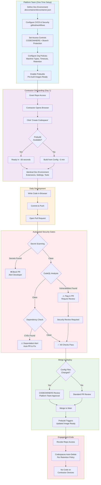

```mermaid
flowchart TB
    subgraph admin["Platform Team (One-Time Setup)"]
        A[Define Dev Environment<br/>.devcontainer/devcontainer.json] --> B[Configure CI/CD & Security<br/>.github/workflows]
        B --> C[Set Access Controls<br/>CODEOWNERS + Branch Protection]
        C --> D[Configure Org Policies<br/>Machine Types, Timeouts, Retention]
        D --> E[Enable Prebuilds<br/>Pre-built Images Ready]
    end

    subgraph contractor["Contractor Onboarding (Day 1)"]
        F[Grant Repo Access] --> G[Contractor Opens Browser]
        G --> H[Click 'Create Codespace']
        H --> I{Prebuild<br/>Available?}
        I -->|Yes| J[Ready in ~30 seconds]
        I -->|No| K[Build from Config ~3 min]
        J --> L[Identical Dev Environment<br/>Extensions, Settings, Tools]
        K --> L
    end

    subgraph dev["Daily Development"]
        L --> M[Write Code in Browser]
        M --> N[Commit & Push]
        N --> O[Open Pull Request]
    end

    subgraph security["Automated Security Gates"]
        O --> P{Secret Scanning}
        P -->|Secrets Found| Q[❌ Block PR<br/>Alert Developer]
        P -->|Clean| R{CodeQL Analysis}
        R -->|Vulnerabilities Found| S[⚠️ Flag in PR<br/>Require Review]
        R -->|Clean| T{Dependency Check}
        T -->|CVEs Found| U[⚠️ Dependabot Alert<br/>Auto-PR to Fix]
        T -->|Clean| V[✅ All Checks Pass]
        S --> W[Security Review Required]
        W --> V
    end

    subgraph approval["Merge & Deploy"]
        V --> X{Config Files<br/>Changed?}
        X -->|Yes| Y[CODEOWNERS Review<br/>Platform Team Approval]
        X -->|No| Z[Standard PR Review]
        Y --> AA[Merge to Main]
        Z --> AA
        AA --> AB[Prebuild Triggers<br/>Updated Image Ready]
    end

    subgraph offboard["Engagement Ends"]
        AC[Revoke Repo Access] --> AD[Codespaces Auto-Delete<br/>Per Retention Policy]
        AD --> AE[No Code on<br/>Contractor Devices]
    end

    E --> F
    AB --> AC

    style admin fill:#e1f5fe
    style contractor fill:#f3e5f5
    style dev fill:#fff3e0
    style security fill:#ffebee
    style approval fill:#e8f5e9
    style offboard fill:#fce4ec
```